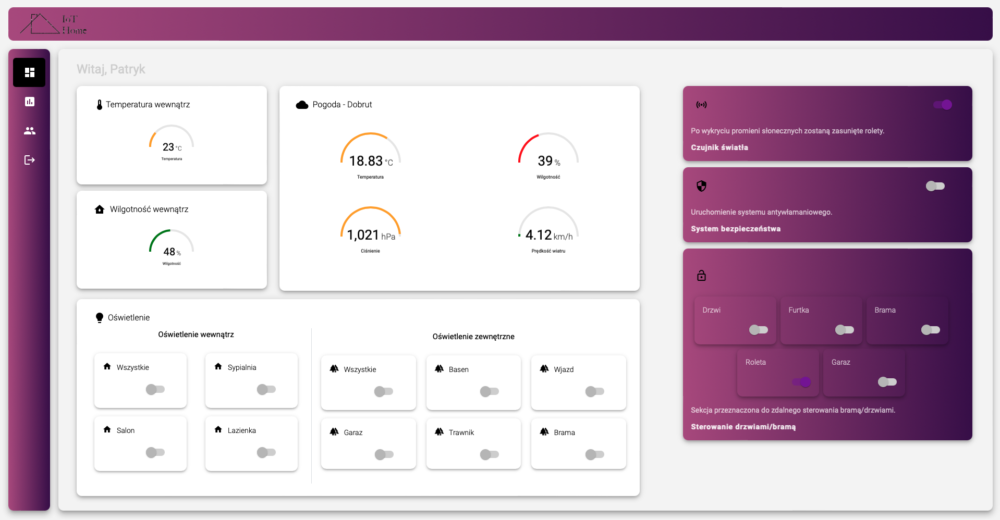
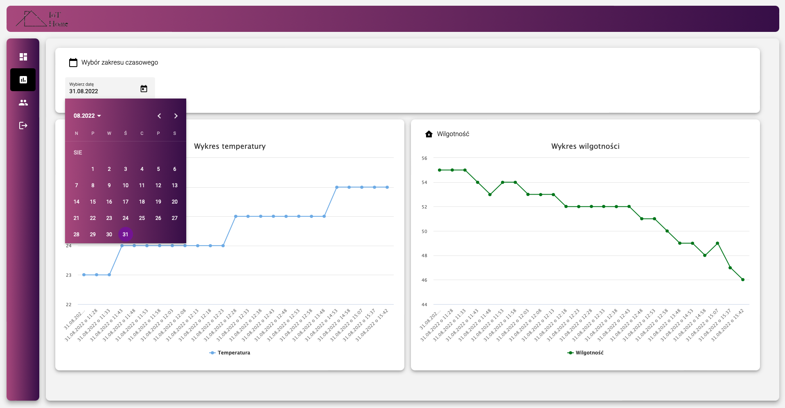
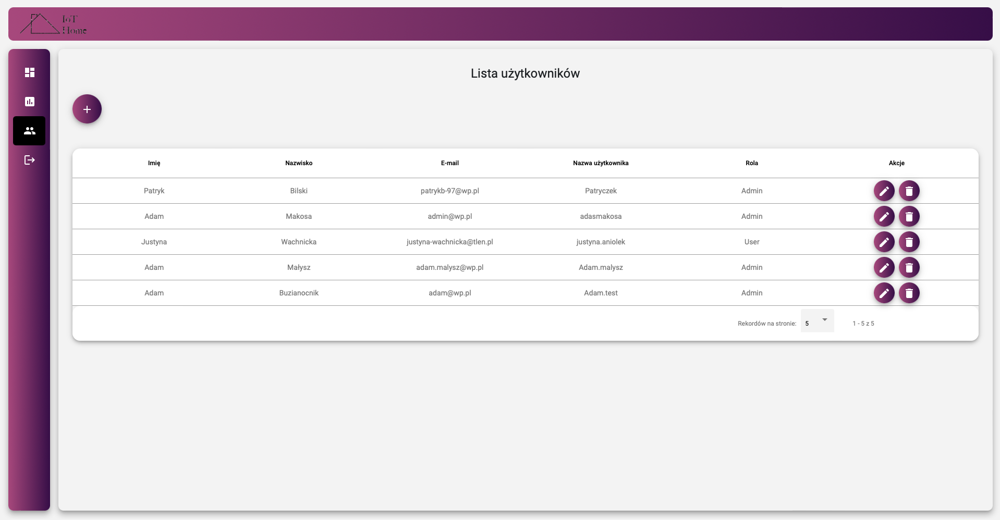
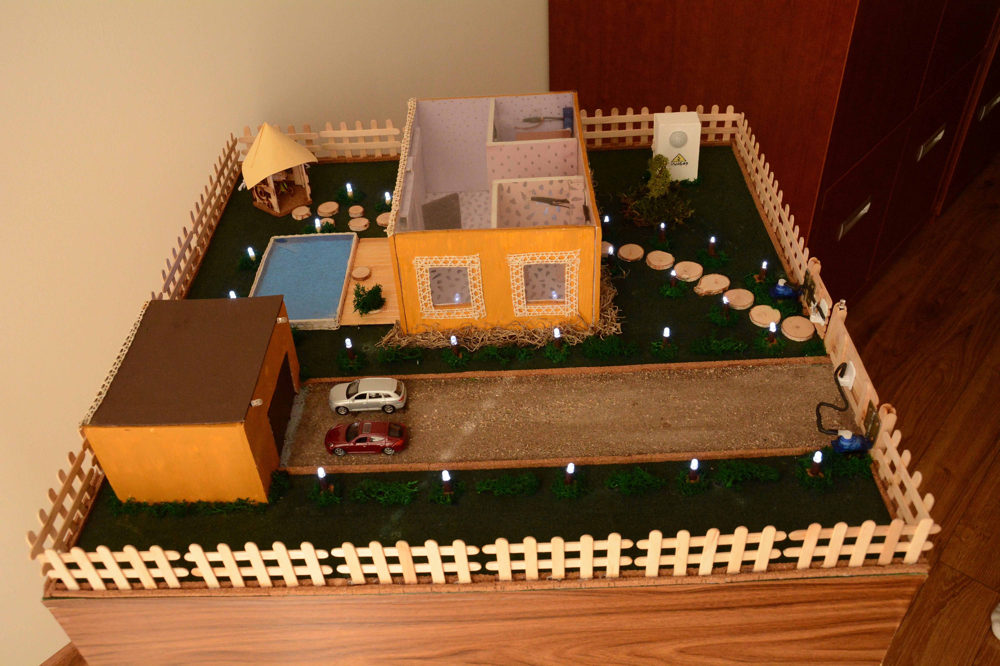

# Smart Home Thesis — Frontend

This repository contains the frontend implementation for an engineering thesis focused on smart-home systems. The application is a web-based interface for monitoring and controlling smart-home devices, visualizing real-time and historical data, and managing user interactions.

## Thesis summary

- **Objective:** Design and implement a modern frontend for a smart-home platform that allows daily users to control devices, monitor environmental conditions, and view historical data through an intuitive interface.
- **Scope:** Angular-based single-page application (SPA) with modular structure, authentication, dashboards, reports, and user administration.
- **Technologies:** Angular, TypeScript, SCSS/CSS, HTML.

## Features

- **Device control:** Users can control lighting, open/close house doors, garage gate, and entrance gate, and turn the alarm on/off.
- **Security integration:** When the alarm detects motion, a push notification is triggered.
- **Environmental monitoring:** Real-time visualization of temperature and humidity from sensors.
- **Historical data:** Users can browse historical readings for temperature, humidity, and other sensor data.
- **Responsive dashboard:** Real-time widgets display the current status of devices and environment.
- **Reports and charts:** Graphical representation of historical data for better analysis.
- **User management:** Authentication, profile management, and admin functionalities including user list and forms.
- **Customizable visualizations:** Configurable gauges and charts for enhanced data insight.

## Screenshots and mockups







## How to run (development)

Make sure you have Node.js and Angular CLI installed. From the project root run:

```powershell
npm install
ng serve
```

Then open http://localhost:4200/ in your browser.

## Project structure

- `src/app/` — application modules and components (auth, core, pages, shared)
- `src/assets/` — static assets (images, icons)
- `src/environments/` — environment configuration


## Credits and contact

This frontend was developed as part of the author's diploma thesis. 

- Author: Patryk Bilski
- Email: bilskipatryk.web@gmail.com
